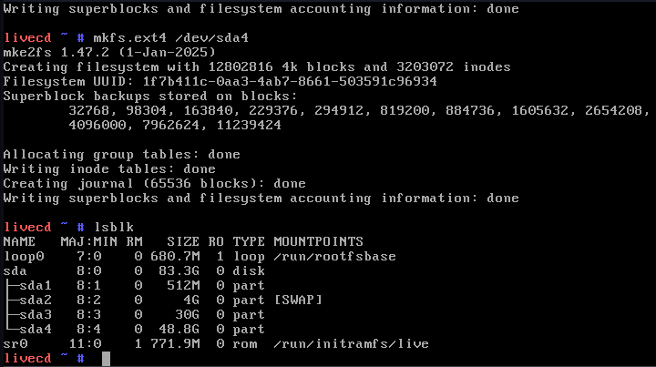

# Paso 3: Preparación del disco

# 0.1 Verificación del disco disponible.

- Se usó el siguiente comando para listar los discos disponibles:
 
      lsblk

## Formateo y Montaje de Particiones en Gentoo

Usando fdisk o parted, creamos las siguientes particiones en el disco /dev/sda:

      /dev/sda1: 512 MB, EFI, punto de montaje /boot

      /dev/sda2: 4 GB, swap (intercambio)

      /dev/sda3: 30 GB, ext4, punto de montaje / (raíz)

      /dev/sda4: resto del espacio, ext4, punto de montaje /home

 # 0.2 Formateo de las Particiones

 Ejecuta estos comandos para formatear cada partición según su uso:

   *Formatear partición EFI como FAT32*

     mkfs.vfat -F 32 /dev/sda1

   *Configurar y activar swap*

     mkswap /dev/sda2
     swapon /dev/sda2

   *Formatear raíz como ext4*

     mkfs.ext4 /dev/sda3

   *Formatear /home como ext4*

     mkfs.ext4 /dev/sda4

# 03 - Montaje de Particiones en Gentoo

## Esquema de particiones usado

| Partición  | Tamaño   | Tipo     | Punto de montaje |
|------------|----------|----------|------------------|
| /dev/sda1  | 512M     | EFI      | /boot            |
| /dev/sda2  | 4G       | swap     | (intercambio)    |
| /dev/sda3  | 30G      | ext4     | /                |
| /dev/sda4  | restante | ext4     | /home            |

---

Activar la partición swap:

     swapon /dev/sda2

Nota: Si aparece un error como swapon failed: device or resource busy, significa que la swap ya está activa.

Montaje de particiones:

Se montan las particiones de esta manera:

     mount /dev/sda3 /mnt/gentoo            # Montar raíz
     mkdir /mnt/gentoo/boot                 # Crear directorio boot
     mount /dev/sda1 /mnt/gentoo/boot       # Montar partición EFI
     mkdir /mnt/gentoo/home                 # Crear directorio home
     mount /dev/sda4 /mnt/gentoo/home       # Montar partición /home

Verificación del montaje:

Puedes usar este comando para verificar que todas las particiones estén montadas correctamente:

    lsblk

